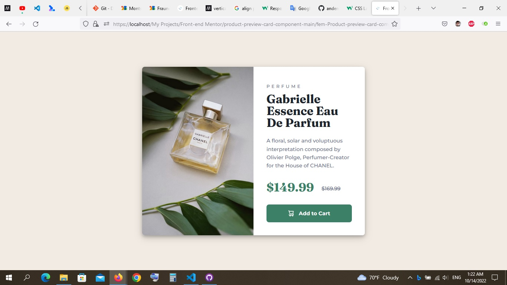

# Frontend Mentor - Product preview card component

## Welcome! 👋

Thanks for checking out this front-end coding challenge.

This is a solution to the [QR code component challenge on Frontend Mentor](https://www.frontendmentor.io/challenges/qr-code-component-iux_sIO_H).

## Overview 

This is my solution for the Product preview car component challenge.
I add some box-shadow effects, media query and some picture elements to help me make this project responsive kinda! :smile:
